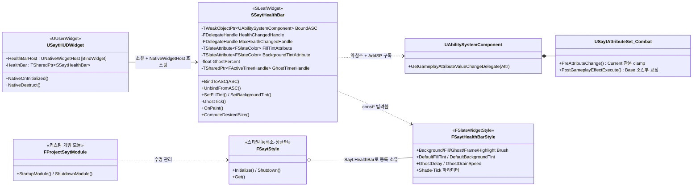
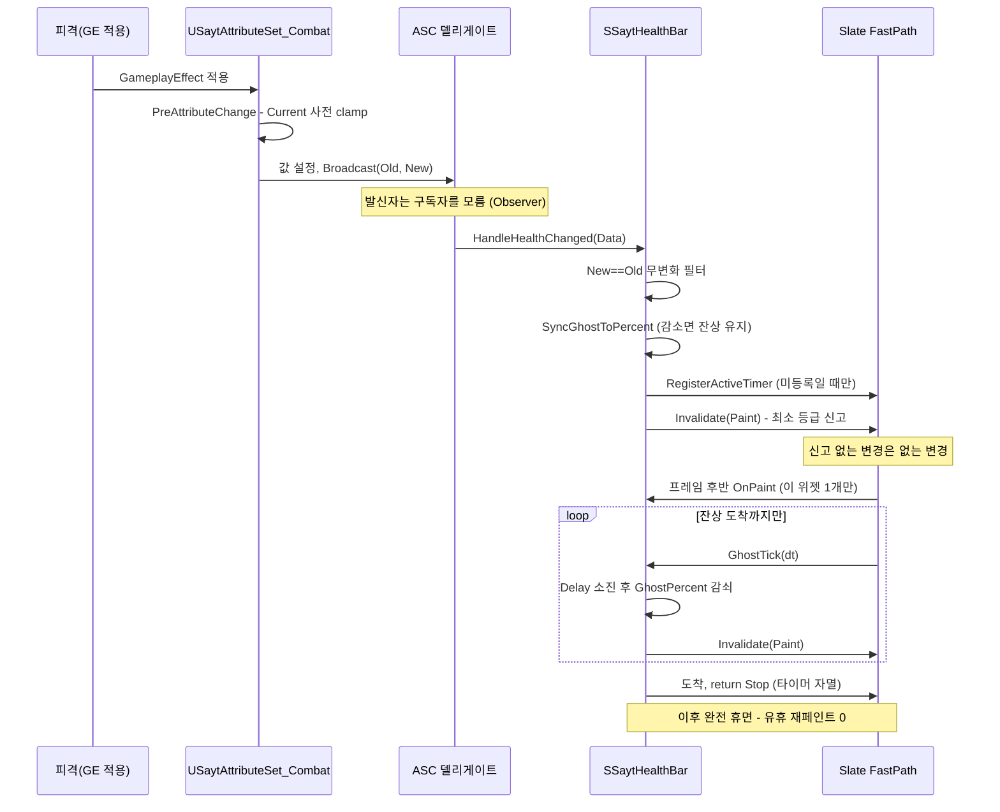

### 클래스/구조

```mermaid
classDiagram
    direction LR
    class SSaytHealthBar {
        <<SLeafWidget>>
        -TWeakObjectPtr~UAbilitySystemComponent~ BoundASC
        -FDelegateHandle HealthChangedHandle
        -FDelegateHandle MaxHealthChangedHandle
        -TSlateAttribute~FSlateColor~ FillTintAttribute
        -TSlateAttribute~FSlateColor~ BackgroundTintAttribute
        -float GhostPercent
        -TSharedPtr~FActiveTimerHandle~ GhostTimerHandle
        +BindToASC(ASC)
        +UnbindFromASC()
        +SetFillTint() / SetBackgroundTint()
        -GhostTick()
        +OnPaint()
        +ComputeDesiredSize()
    }
    class FSaytHealthBarStyle {
        <<FSlateWidgetStyle>>
        +Background/Fill/Ghost/Frame/Highlight Brush
        +DefaultFillTint / DefaultBackgroundTint
        +GhostDelay / GhostDrainSpeed
        +Shade·Tick 파라미터
    }
    class FSaytStyle {
        <<스타일 등록소·싱글턴>>
        +Initialize() / Shutdown()
        +Get()
    }
    class USaytHUDWidget {
        <<UUserWidget>>
        +HealthBarHost : UNativeWidgetHost [BindWidget]
        -HealthBar : TSharedPtr~SSaytHealthBar~
        +NativeOnInitialized()
        +NativeDestruct()
    }
    class UAbilitySystemComponent {
        +GetGameplayAttributeValueChangeDelegate(Attr)
    }
    class USaytAttributeSet_Combat {
        +PreAttributeChange() Current 관문 clamp
        +PostGameplayEffectExecute() Base 조건부 교정
    }
    class FProjectSaytModule {
        <<커스텀 게임 모듈>>
        +StartupModule() / ShutdownModule()
    }
    USaytHUDWidget --> SSaytHealthBar : 소유 + NativeWidgetHost 호스팅
    SSaytHealthBar ..> UAbilitySystemComponent : 약참조 + AddSP 구독
    UAbilitySystemComponent *-- USaytAttributeSet_Combat
    SSaytHealthBar ..> FSaytHealthBarStyle : const* 빌려씀
    FSaytStyle o-- FSaytHealthBarStyle : Sayt.HealthBar로 등록·소유
    FProjectSaytModule ..> FSaytStyle : 수명 관리
```

### 시퀀스: 피격 1회의 전체 수명

```mermaid
sequenceDiagram
    participant Player as 피격(GE 적용)
    participant AS as USaytAttributeSet_Combat
    participant ASC as ASC 델리게이트
    participant Bar as SSaytHealthBar
    participant Slate as Slate FastPath

    Player->>AS: GameplayEffect 적용
    AS->>AS: PreAttributeChange - Current 사전 clamp
    AS->>ASC: 값 설정, Broadcast(Old, New)
    Note over ASC: 발신자는 구독자를 모름 (Observer)
    ASC->>Bar: HandleHealthChanged(Data)
    Bar->>Bar: New==Old 무변화 필터
    Bar->>Bar: SyncGhostToPercent (감소면 잔상 유지)
    Bar->>Slate: RegisterActiveTimer (미등록일 때만)
    Bar->>Slate: Invalidate(Paint) - 최소 등급 신고
    Note over Slate: 신고 없는 변경은 없는 변경
    Slate->>Bar: 프레임 후반 OnPaint (이 위젯 1개만)
    loop 잔상 도착까지만
        Slate->>Bar: GhostTick(dt)
        Bar->>Bar: Delay 소진 후 GhostPercent 감쇠
        Bar->>Slate: Invalidate(Paint)
    end
    Bar->>Slate: 도착, return Stop (타이머 자멸)
    Note over Bar,Slate: 이후 완전 휴면 - 유휴 재페인트 0
```