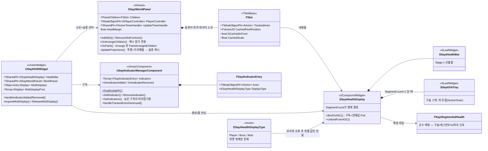
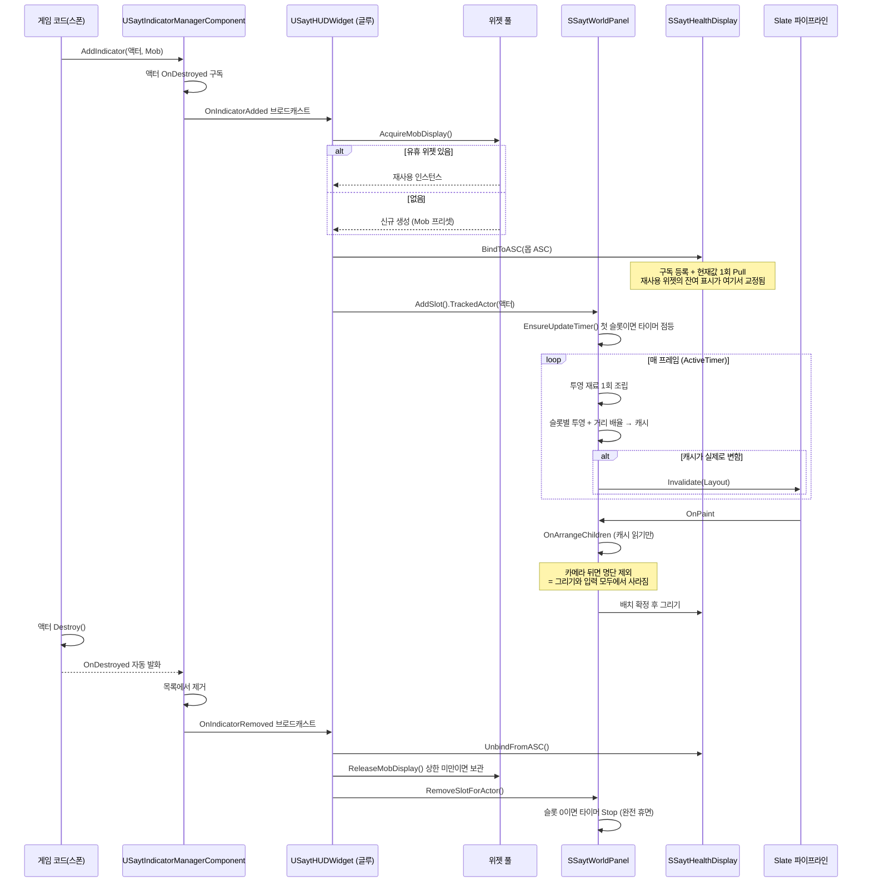

### 클래스/구조

**경계 요약**
- 게임 쪽(`USaytIndicatorManagerComponent`)은 위젯을 모른다
- UI 쪽(`SSaytWorldPanel`)은 액터를 알지만 그것이 무엇인지 모른다 (위치만 사용)
- 위젯(`SSaytHealthDisplay` 이하)은 액터도 몬스터도 모른다 (값만 받음)
- 글루(`USaytHUDWidget`)만 양쪽을 안다 → 데이터 소스 교체 시 이 한 곳만 수정

---

### 시퀀스: 몹 한 마리의 전체 수명

**이 흐름에서 읽을 것**
- 게임 코드는 등록만 하고 해제를 신경 쓰지 않는다 — 파괴 이벤트가 대신한다
- 위젯 생성은 풀을 거치고, 재사용 시 상태 교정은 `BindToASC`가 겸한다
- 투영(외부 세계 읽기)과 배치(순수 계산)가 분리되어 있다
- 추적 대상이 없으면 타이머가 스스로 내려가 비용이 0이 된다
